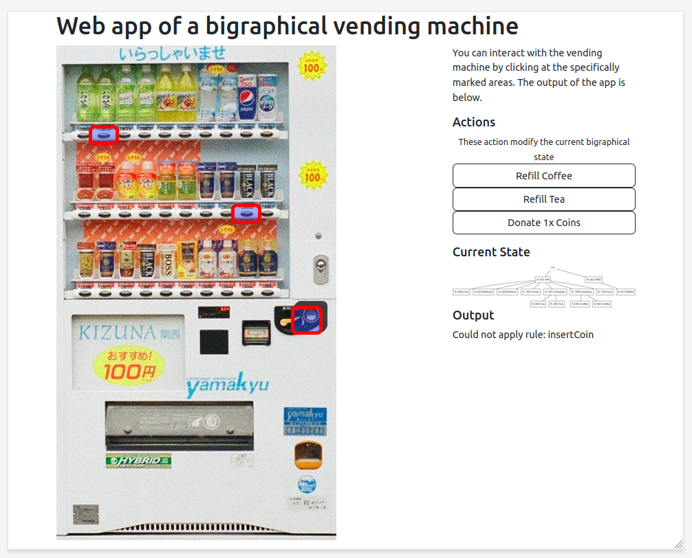
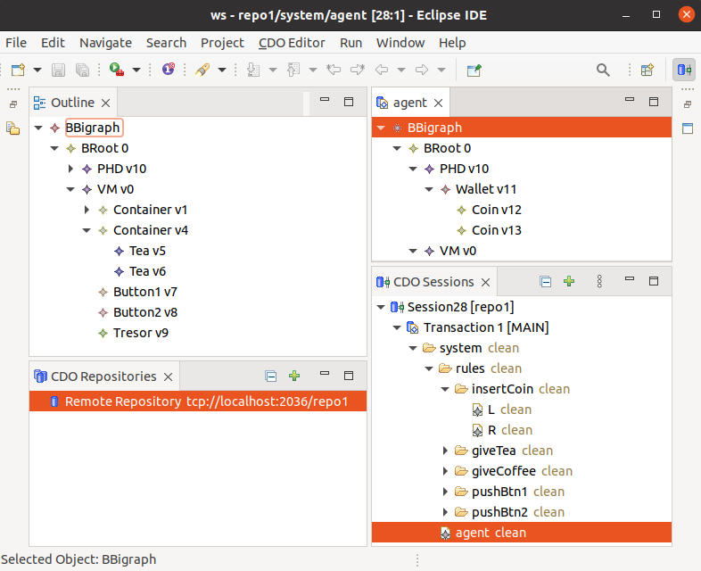

# Bigraphs by Examples: A Bigraphical Vending Machine as a Webservice Application

#### Features

- A project template for similar projects
  - Suitable to abstract from and build some code generation around 
- Application data and logic is stored fully within a database as bigraphs
- Bigraphical reactions are initiated by REST requests
- State of the application can be changed 
  - At run-time: by changing the database model
  - At design-time: by changing the initial agent, rules and predicates loaded at startup within the folder `src/main/resources` 
- Behavior of the application is model checked
  - Results of the analysis is used for the application

#### Interesting Future Work
- Support runtime monitoring of the BRS specification in case the architecture is refactored in a way that violates the original specification

#### Requirements

- Java 17
- Maven 3.8.7
- Spring 2.7.5
- Bigraph Framework 2.0.1
- BDSL 2.0.1
- CDO for Spring Data 0.7.2

**Optional**
- CDO Explorer: to view and modify the bigraph in the database 
  1) Download CDO Explorer via the [Eclipse Installer](https://www.eclipse.org/downloads/packages/installer).
     Use Eclipse Version 2022-12 (4.26.0), which supports CDO protocol version **48**.
     Eclipse IDE version 2023-09 supports only CDO protocol version 49.
  2) Any Eclipse IDE with CDO support, must support **CDO protocol version 48**

#### Screenshots

|                          |                   |
|-------------------------------------------------------------------------------|------------------------------------------------------------------------------------|
| Screenshot of the UI: The web UI allows interaction with the vending machine. | Screenshot of the CDO Explorer: Bigraphs are stored as Ecore models in a database. |


## Getting Started

### Via the IDE (Eclipse or IntelliJ IDEA)

- Run the class `src/main/java/org/example/Application.java`

### Via the Terminal
Using Maven, issue the following command:
```shell
mvn clean package -DskipTests
```

The JAR file is created within the `target` folder of the project's root folder.

To run the application JAR file, execute the following command:
```shell
java -jar ./target/code-samples-1.0-SNAPSHOT.jar
```

(Ignore warnings in the console.)

### Open the Browser

Afterwards, open any browser and go to the following URL:
```
http://localhost:8080/
```

## Remarks

### Database & Configuration

- The database configuration file is stored here: `src/main/resources/config/cdo-server.xml`
- Every time the application starts, a fresh in-memory CDO database is created
- The state of the program is not persisted, when the application is shut down

- Listeners for concrete objects in CDO can be attached _before_ they are stored in the database
  - but it is recommended to register listeners after

[//]: # (- "If no model contains feature maps commit performance can be slightly increased by specifying -Dorg.eclipse.emf.cdo.internal.server.Repository.DISABLE_FEATURE_MAP_CHECKS=true")


### Analysis

- Analysis is placed in the `./src/test` folder of this project
- Execute the unit tests to perform the analysis
- With the IDE or via Maven `mvn -Dtest=Analysis test` 

- The results are stored in the resource folder
  - Rules, predicates and the metamodel
- The results are re-used for the implementation

